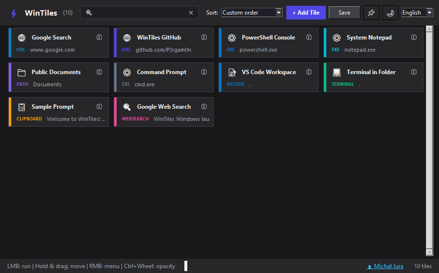

# WinTiles - Modern Windows 11 Desktop Productivity Launcher

A lightweight, fast, and elegant Python/Tkinter desktop application for Windows 11 that allows instant launching of websites, folders, applications, scripts, WSL commands, VS Code workspaces, and quick copying of AI prompts and snippets to the clipboard.



---

## ⚡ Quick Start & Running the Application

1. **Requirements**:
   - Python 3.8+ (tested on Python 3.13).
   - Standard Python libraries (`tkinter`, `ctypes`, `subprocess`, `json`, `pathlib`).

2. **Launch Options**:
   - Double-click `run.bat`, or
   - Run in terminal:
     ```powershell
     python app.py
     ```

---

## Key Features

### 1. Drag & Drop Reordering
- Click and hold **LMB** on any tile to pick it up.
- While dragging, a semi-transparent miniature preview follows the cursor, and the target tile highlights in blue.
- Dropping onto another tile instantly reorders the list.
- Reordering automatically sets the sorting mode to **Custom order** and saves your preferences.

### 2. Dedicated Description & Smart Info Tooltip („ⓘ”)
- Each tile can have an optional description (`Description (optional)`).
- When a description is set, an elegant **„ⓘ”** info icon appears in the top-right corner of the tile.
- Hovering over the **„ⓘ”** icon displays a tooltip with the complete description text.
- The tile subtitle cleanly displays a shortened preview of the target path/URL without clutter.
- If no description is provided, the **„ⓘ”** icon is hidden to maintain a clean interface.

### 3. Flexible Tile Sorting
Choose from multiple sorting modes in the top-right dropdown:
- **Custom order (Manual)** – Drag & drop custom ordering.
- **Most used** – Automatic sorting based on click/execution counter (`use_count`).
- **Recently used** – Most recently launched tiles appear at the top.
- **Name (A - Z)** & **Name (Z - A)** – Alphabetical sorting.
- **Date added (newest / oldest)** – Chronological sorting.
- **Action type** – Grouping tiles by action category.

### 4. 14 Action Types Supported
1. `url` – Open web pages in your default browser.
2. `path` – Open folders in Windows Explorer.
3. `file` – Open documents or files in default applications.
4. `exe` – Run executable files (`.exe`).
5. `ps1` – Execute PowerShell scripts (`.ps1`).
6. `python` – Execute Python scripts (`.py`).
7. `bat` – Execute batch files (`.bat` / `.cmd`).
8. `terminal` – Launch Windows Terminal or PowerShell in a specific directory.
9. `vscode` – Open files or folders directly in Visual Studio Code.
10. `wsl` – Run Linux commands or bash shells via WSL.
11. `clipboard` – Copy prompts, snippets, or tokens to the clipboard with toast feedback.
12. `websearch` – Execute Google web searches directly in your browser.
13. `chrome_profile` – Launch or switch to specific Google Chrome profiles.
14. `command` – Execute custom Windows shell commands.

### 5. Smooth Window Transparency (Ctrl + Mouse Wheel)
- Hold **Ctrl** and scroll the **mouse wheel** to adjust window opacity between **100% and 10%**.
- Real-time percentage indicator appears on the status bar (e.g. `Window opacity: 85%`).
- Opacity settings persist across application restarts.

### 6. Modern Windows 11 UI
- **Header Tooltips**: Hover over control buttons (topmost **📌**, dark mode **🌙/☀️**, clear search **✕**, add tile, save) for quick contextual hints.
- **Windows 11 Dark Title Bar**: Native DWM integration for seamless dark title bars.
- **Live Search**: Instant real-time tile filtering by name, action type, target path, or description.
- **Right-Click Context Menu**:
  - 🚀 Run
  - ✏️ Edit
  - 📋 Duplicate
  - 🔄 Reset usage count
  - 🗑️ Delete

---

## Running from Source

1. Requirements: Python 3.8+ (tested on Python 3.13).
2. Launch via:
   - Double-clicking `run.bat`, or
   - Terminal command:
     ```powershell
     python app.py
     ```

## Automated Testing

Run the full unit and integration test suite:
```powershell
pytest -v
```

---

## Configuration Format (`tiles.json`)

Settings and tiles are saved to `tiles.json`. Sample clean configuration:

```json
{
  "always_on_top": false,
  "dark_mode": true,
  "language": "en",
  "sort_by": "manual",
  "tiles": [
    {
      "name": "Google Search",
      "action_type": "url",
      "target": "https://www.google.com",
      "color": "#0284c7",
      "description": "Default web search engine",
      "use_count": 5,
      "created_at": "2026-09-14T10:00:00",
      "last_used": "2026-09-14T11:00:00",
      "order": 0
    }
  ]
}
```

---

## Author & License

- **Author**: Michał Jura
- **GitHub**: [https://github.com/P3rgam0n](https://github.com/P3rgam0n)
- **Repository**: [https://github.com/P3rgam0n/WinTiles](https://github.com/P3rgam0n/WinTiles)
